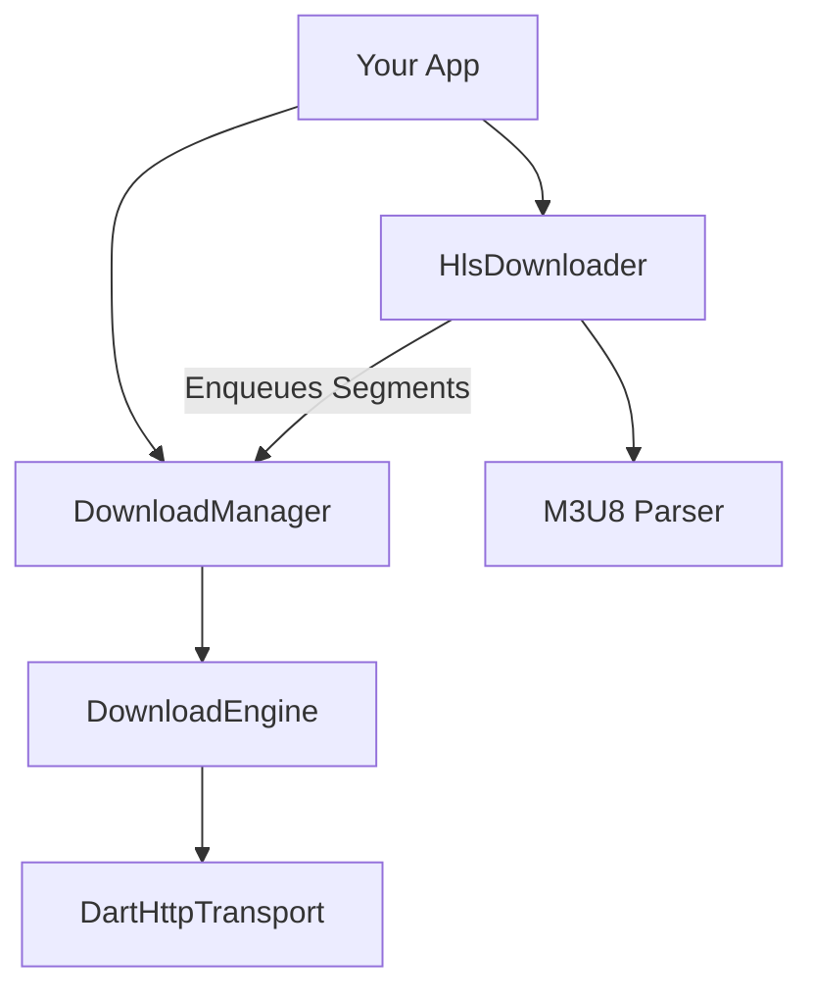

# Downloader Ecosystem

[](https://opensource.org/licenses/MIT)
[](https://flutter.dev/)
[](https://dart.dev/)

A highly scalable, modular, and production-ready downloading ecosystem for Dart and Flutter. 

Unlike standard "fire and forget" HTTP libraries, this ecosystem is built from the ground up for massive files and complex protocols. It features strict memory management, robust concurrency limits, and a plugin-style architecture.

---

## Installation

This ecosystem is split into two packages. Add the ones you need to your `pubspec.yaml`:

```yaml
dependencies:
  # For standard file downloads (images, zips, mp4s)
  byte_me_core:
    path: packages/byte_me_core
  
  # For HLS video streaming (automatically includes byte_me_core)
  byte_me_hls:
    path: packages/byte_me_hls
```

## Getting Started: Standard Downloads

If you just need to download standard files reliably, use `byte_me_core`.

### 1. Initialize the Engine
```dart
import 'package:byte_me_core/byte_me_core.dart';

// Use the default HTTP transport or provide your own implementation
final transport = DartHttpTransport();
final engine = DownloadEngine(transport);

// The DownloadManager handles task queuing and concurrency limits
final manager = DownloadManager(
  engine: engine, 
  maxConcurrentDownloads: 3, 
);
```

### 2. Start a Download
```dart
import 'dart:io';
import 'package:byte_me_core/byte_me_core.dart';

final request = DownloadRequest(
  id: 'unique_task_id',
  url: Uri.parse('https://example.com/large_file.zip'),
  destination: File('/path/to/save/file.zip'),
);

final task = DownloadTask(request: request);

// Listen to network speed and progress
task.progressStream.listen((progress) {
  print('Progress: ${(progress.percentage * 100).toStringAsFixed(1)}%');
});

// Put the task in the queue
manager.enqueue(task);
```

## Getting Started: HLS Video Streams

If you need to download encrypted or chunked HLS (`.m3u8`) streams, use `byte_me_hls`.

```dart
import 'package:byte_me_core/byte_me_core.dart';
import 'package:byte_me_hls/byte_me_hls.dart';

void main() async {
  final transport = DartHttpTransport();
  final engine = DownloadEngine(transport);
  
  // For HLS, maxConcurrentDownloads dictates how many segments download simultaneously
  final manager = DownloadManager(engine: engine, maxConcurrentDownloads: 4);
  final hlsDownloader = HlsDownloader(manager);

  await hlsDownloader.downloadHlsVideo(
    m3u8Url: 'https://test-streams.mux.dev/x36xhzz/x36xhzz.m3u8',
    savePath: '/path/to/save/my_movie.mp4',
    onProgress: (HlsProgress progress) {
      print('HLS Progress: ${progress.formattedPercentage} | Speed: ${progress.formattedSpeed}');
      print('Segments: ${progress.completedSegments}/${progress.totalSegments}');
    },
  );

  print('Video download and stitching complete!');
}
```

## Architecture Overview



## Contributing
Contributions are welcome! Please feel free to submit a Pull Request or open an Issue to discuss improvements.
