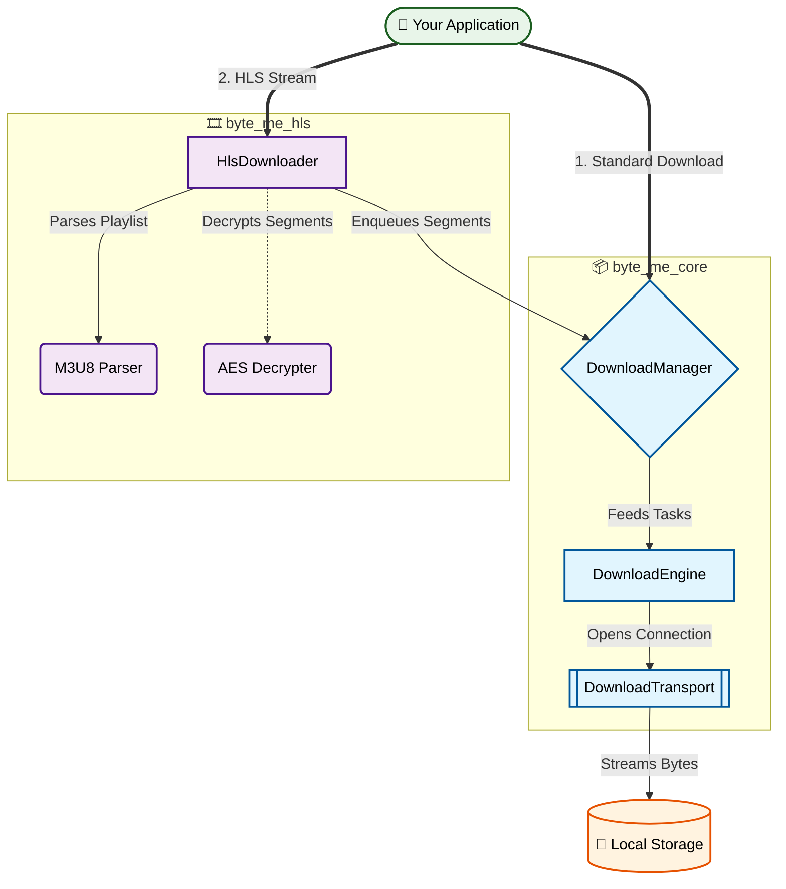

# Byte Me Ecosystem

[](https://opensource.org/licenses/MIT)
[](https://flutter.dev/)
[](https://dart.dev/)
[](https://pub.dev/packages/byte_me_core)

A highly scalable, modular, and production-ready downloading ecosystem for Dart and Flutter. 

Unlike standard "fire and forget" HTTP libraries, the **Byte Me** ecosystem is built from the ground up to handle massive files, complex media protocols, and highly concurrent workloads without blocking the UI or crashing due to memory exhaustion.

---

## Table of Contents
- [Packages](#packages)
- [Why Byte Me?](#why-byte-me)
- [Installation](#installation)
- [Getting Started](#getting-started)
  - [Standard Downloads](#standard-downloads-byte_me_core)
  - [HLS Video Streams](#hls-video-streams-byte_me_hls)
- [Architecture](#architecture-overview)
- [Contributing](#contributing)

---

## Packages

This monorepo is split into focused, single-responsibility packages.

| Package | Description | Pub |
|---|---|---|
| [`byte_me_core`](./packages/byte_me_core) | The foundational download engine. Handles concurrency, task queuing, pausing, resuming, and network abstractions. | [](https://pub.dev/packages/byte_me_core) |
| [`byte_me_hls`](./packages/byte_me_hls) | A specialized HLS (`.m3u8`) downloader built on the core engine. Handles segment batching, AES-128 decryption, and automatic video stitching. | [](https://pub.dev/packages/byte_me_hls) |

## Why Byte Me?

- **Strict Memory Management**: Downloads are streamed directly to disk. We batch segment downloads so large HLS streams never crash your app.
- **Robust Concurrency**: You dictate exactly how many parallel connections are allowed. The engine queues the rest.
- **Transport Agnostic**: The engine doesn't care if you use `http`, `dio`, or native sockets. Implement `DownloadTransport` and bring your own networking layer.
- **Extensible Plugin System**: The core engine is designed to be built upon, exactly as we did with the HLS package.

## Installation

Add the packages you need to your `pubspec.yaml`:

```yaml
dependencies:
  byte_me_core: ^1.0.0
  byte_me_hls: ^1.0.0
```

## Getting Started

### Standard Downloads (`byte_me_core`)

Perfect for simple files, ZIPs, PDFs, or direct MP4s.

```dart
import 'dart:io';
import 'package:byte_me_core/byte_me_core.dart';

// 1. Initialize the Engine
final transport = DartHttpTransport();
final engine = DownloadEngine(transport);

// 2. Setup the Manager with a strict concurrency limit
final manager = DownloadManager(
  engine: engine, 
  maxConcurrentDownloads: 3, 
);

// 3. Define the Request
final request = DownloadRequest(
  id: 'unique_task_id',
  url: Uri.parse('https://example.com/large_file.zip'),
  destination: File('/path/to/save/file.zip'),
);

final task = DownloadTask(request: request);

// Listen to network speed and progress
task.progressStream.listen((progress) {
  print('Progress: ${(progress.percentage * 100).toStringAsFixed(1)}%');
  print('Speed: ${progress.networkSpeed} bytes/sec');
});

// Enqueue it!
manager.enqueue(task);
```

### HLS Video Streams (`byte_me_hls`)

Perfect for offline video playback and DRM-protected or encrypted streams.

```dart
import 'package:byte_me_core/byte_me_core.dart';
import 'package:byte_me_hls/byte_me_hls.dart';

void main() async {
  final transport = DartHttpTransport();
  final engine = DownloadEngine(transport);
  
  // For HLS, this dictates how many .ts segments download simultaneously
  final manager = DownloadManager(engine: engine, maxConcurrentDownloads: 4);
  final hlsDownloader = HlsDownloader(manager);

  await hlsDownloader.downloadHlsVideo(
    m3u8Url: 'https://test-streams.mux.dev/x36xhzz/x36xhzz.m3u8',
    savePath: '/path/to/save/my_movie.mp4',
    onProgress: (HlsProgress progress) {
      print('HLS Progress: ${progress.formattedPercentage} | Speed: ${progress.formattedSpeed}');
      print('Segments: ${progress.completedSegments}/${progress.totalSegments}');
    },
  );

  print('Video download and stitching complete!');
}
```

## Architecture Overview



## Contributing
We welcome contributions! Please open an issue before submitting a large pull request to discuss the changes you wish to make.
